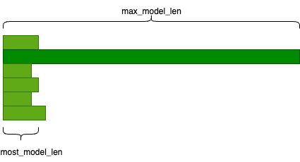

# **TPU Optimization Tips**

This doc serves as a collection of handy tips for optimizing your vLLM on TPU workload.

### **Get started**

Looking for setup and installation instructions? Find them [here](https://vllm--19708.org.readthedocs.build/en/19708/getting_started/installation/google_tpu.html).

### **TPU workload sizing**

When selecting the ideal number of chips for a single serving instance, it's important to account for both the model size and the average request context length. Adequate HBM for the KV cache is essential to ensure a sufficient number of concurrent requests can be processed.

The following colab [calculator](https://colab.sandbox.google.com/drive/1M_f3xZm-_Ce2D-UMAyGNyacEIN-6rUbf) will tell you:

- KV cache size requirement per token and per request
- TPU/GPU memory consumed by the model weights
- TPU/GPU memory allocated for the KV cache
- Maximum \# of requests you can approximately set (--max-num-seqs)

This approach serves as a general rule of thumb. As latency becomes more important, you may want to reduce –max-num-seqs and/or increase the number of chips in increments of 128.

### **Optimize based on your data**

#### *max model len vs. most model len*

If most of your requests are shorter than the maximum model length but you still need to accommodate occasional longer requests, setting a high maximum model length can negatively impact performance. In these cases, you can try introducing most model len by specifying the `VLLM_TPU_MOST_MODEL_LEN` environment variable.

For example, 1% requests are 32k length and 99% requests are 2k length. You can pass 32k into `--max-model-len 32000` and use `VLLM_TPU_MOST_MODEL_LEN=2000`.

The requests get subdivided into max-model-len and most-model-len categories, for the latter category, we can gain better performance since the server can process more requests at a time.

#### *Padding*

For online serving with latency requirements, consider switching to bucket padding by setting the `VLLM_TPU_BUCKET_PADDING_GAP` environment variable. Because of the layout of the TPU, try using increments of 128: 128, 256, etc.

The server pads the requests into fixed lengths before sending them to the model to avoid recompilation. Currently, there are 2 ways to pad the requests:

1) the default exponential padding (pad to the nearest power of 2)
2) bucket padding (pad to the nearest linearly increasing bucket). 

When using bucket padding, the buckets start from 16, end at max_model_len, and increment by `VLLM_TPU_BUCKET_PADDING_GAP`. 

For example, max_model_len=512, padding_gap=64, the buckets will be [16, 32, 64, 128, 192, 256, 320, 384, 448, 512].

The fewer tokens we pad, the less unnecessary computation TPU does, the better performance we can get. For example, if num_tokens=300, with exponential padding, we pad to 512, with the bucket_padding above, we pad to 320.

However, you need to be careful to choose the padding gap. If the gap is too small, it means the number of buckets is large, leading to increased warmup (precompile) time and higher memory to store the compiled graph. Too many compilaed graphs may lead to HBM OOM. Conversely, an overly large gap yields no performance improvement compared to the default exponential padding.

### **If possible, use the precision that matches the chip’s hardware acceleration**

- v5e has int4/int8 hardware acceleration in the MXU
- v6e has int4/int8 hardware acceleration in the MXU

### **Don't set TP to be less than the number of chips on a single-host deployment**

Although it’s common to do this with GPUs, don't try to fragment 2 or 8 different workloads across 8 chips on a single host. If you need 1 or 4 chips, just create an instance with 1 or 4 chips (these are partial-host machine types).

### **Tune your workloads!**

Although we try to have great default configs, we strongly recommend you check out the [vLLM auto-tuner](https://github.com/vllm-project/vllm/pull/20779/files?short_path=f9b273a#diff-f9b273a10e0688ba63c38bd93a2e64ceb54d4fdd7ff7b82d347df06d0d34e39c) to optimize your workloads for your use case.