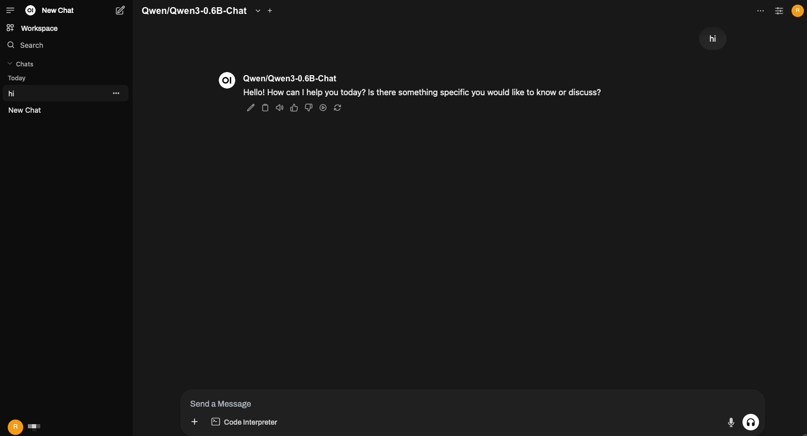

[](){ #deployment-open-webui }

[Open WebUI](https://github.com/open-webui/open-webui) is an extensible, feature-rich,
and user-friendly self-hosted AI platform designed to operate entirely offline.
It supports various LLM runners like Ollama and OpenAI-compatible APIs,
with built-in RAG capabilities, making it a powerful AI deployment solution.

To get started with Open WebUI using vLLM, follow these steps:

1. Install the [Docker](https://docs.docker.com/engine/install/).

2. Start the vLLM server with a supported chat completion model:

    ```console
    vllm serve Qwen/Qwen3-0.6B-Chat
    ```

    !!! note
        When starting the vLLM server, be sure to specify the host and port using the `--host` and `--port` flags.
        For example:

        ```console
        python -m vllm.entrypoints.openai.api_server --host 0.0.0.0 --port 8000
        ```

3. Start the Open WebUI Docker container:

    ```console
    docker run -d \
        --name open-webui \
        -p 3000:8080 \
        -v open-webui:/app/backend/data \
        -e OPENAI_API_BASE_URL=http://0.0.0.0:8000/v1 \
        --restart always \
        ghcr.io/open-webui/open-webui:main
    ```

4. Open it in the browser: <http://open-webui-host:3000/>

    At the top of the page, you should see the model `Qwen/Qwen3-0.6B-Chat`.

    
