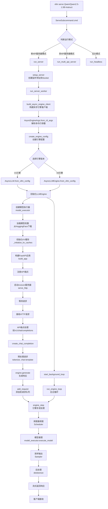

# vLLM Serve 命令运行流程详解

## 运行流程图

## 详细流程说明

### 1. 命令入口（A -> B）
当你运行 `vllm serve Qwen/Qwen2.5-1.5B-Instruct` 时：
- 命令被解析到 `ServeSubcommand.cmd()` 方法
- `Qwen/Qwen2.5-1.5B-Instruct` 作为模型参数被传入

### 2. 运行模式判断（C）
系统会根据参数判断运行模式：
- **单API服务器模式**（默认）：`api_server_count = 1`
- **多API服务器模式**：`api_server_count > 1`
- **无头模式**：`--headless` 参数启用，只运行引擎不启动API服务

### 3. 服务器初始化（D -> H）
在单服务器模式下：
1. `setup_server()` 创建监听地址和Socket
2. `run_server_worker()` 启动服务器工作进程

### 4. 引擎客户端构建（I -> L）
构建异步引擎客户端的过程：
1. 解析命令行参数生成 `AsyncEngineArgs`
2. 创建 `VllmConfig` 配置对象，包含：
   - 模型配置（ModelConfig）
   - 缓存配置（CacheConfig）
   - 并行配置（ParallelConfig）
   - 调度器配置（SchedulerConfig）
3. 根据环境变量 `VLLM_USE_V1` 选择引擎版本

### 5. 引擎初始化（M/N -> O）
无论是V1还是V0引擎，都会：
1. 创建 `LLMEngine` 实例
2. 初始化各种组件（调度器、输出处理器等）

### 6. 模型加载（P -> R）
这是最关键的步骤之一：
1. **创建模型执行器**：根据配置选择合适的执行器（GPU/CPU/TPU等）
2. **下载模型权重**：从HuggingFace下载 `Qwen/Qwen2.5-1.5B-Instruct` 模型
3. **加载模型到显存**：将模型权重加载到GPU
4. **初始化KV缓存**：预分配用于注意力机制的键值缓存

### 7. API服务器启动（S -> V）
1. 构建FastAPI应用实例
2. 注册各种API端点：
   - `/v1/chat/completions` - 聊天补全
   - `/v1/completions` - 文本补全
   - `/v1/embeddings` - 嵌入向量
   - `/v1/models` - 模型列表
3. 启动Uvicorn HTTP服务器
4. 等待客户端请求

### 8. 请求处理流程（W -> AI）
当收到一个聊天请求时：

1. **API端点处理**（X）：路由到相应的处理函数
2. **预处理**（Y -> Z）：
   - 应用聊天模板（chat template）
   - 文本分词（tokenization）
   - 验证参数
3. **生成请求**（AA -> AB）：
   - 调用 `engine.generate()` 
   - 请求被添加到引擎的请求队列
4. **引擎处理**（AC -> AF）：
   - **调度器调度**：决定哪些请求可以并行处理
   - **模型推理**：在GPU上执行transformer计算
   - **采样输出**：根据采样参数生成token
5. **后处理**（AG）：
   - 将token解码为文本
   - 检查停止条件
6. **流式返回**（AH）：
   - 以Server-Sent Events格式返回
   - 客户端实时接收生成的文本

### 9. 后台引擎循环（AJ -> AK）
引擎启动后会运行一个后台循环：
- 持续检查请求队列
- 批量处理请求以提高吞吐量
- 管理内存和缓存
- 处理模型输出

## 关键优化点

1. **批处理**：vLLM会将多个请求批量处理，提高GPU利用率
2. **PagedAttention**：使用分页注意力机制，优化KV缓存的内存使用
3. **连续批处理**：动态调整批次大小，新请求可以随时加入
4. **异步处理**：使用异步架构，提高并发处理能力

## 总结

整个流程从命令行开始，经过参数解析、引擎初始化、模型加载、API服务器启动，最终能够接收和处理用户的推理请求。vLLM的设计充分考虑了性能优化，通过批处理、内存优化、异步处理等技术，实现了高效的大语言模型服务。